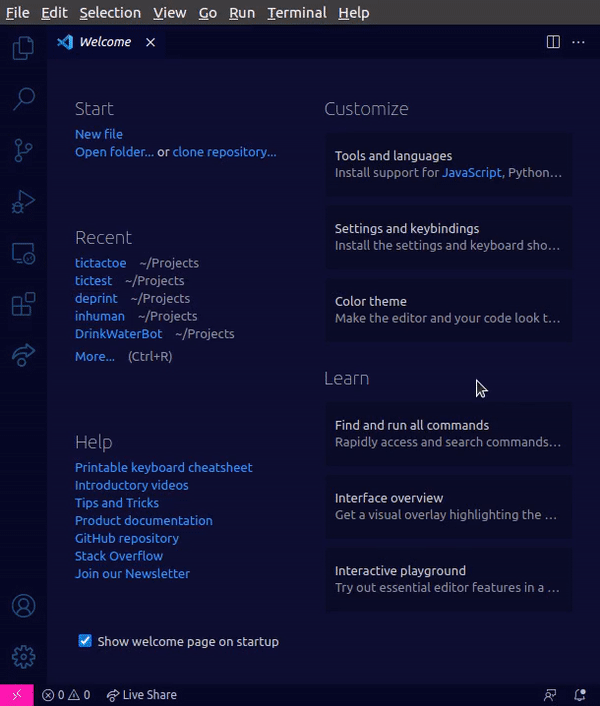

# TicTacToe

<!--  -->

 
Ever get bored while waiting for your code to compile? Do you sometimes just feel like you need a small break from all the coding?  

Presenting **TicTacToe** _inside_ VS Code!

## Features

Enjoy a quick game of TicTacToe right from the comfort of your own VS Code workspace. 

## Usage

Head to the Command Palette and search for `Start a new TicTacToe game` to get started.

## Future Upgrades

Upgraded AI and multiplayer coming soon!

## Contributing
Checkout the [Contributing Guildelines](https://github.com/acmpesuecc/tictactoe/blob/master/CONTRIBUTING.md)

## How to run
yarn install
click fn+F5 key
click Debug anyway
